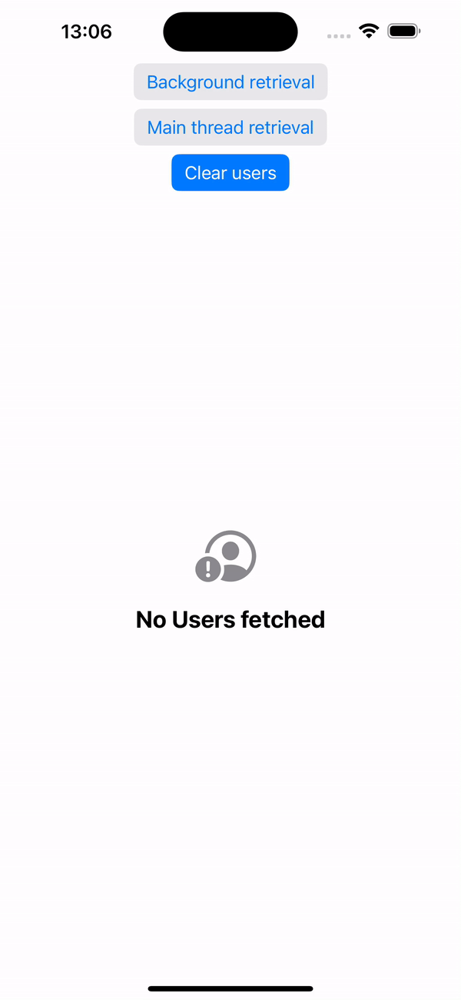
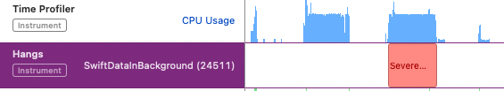

# SwiftDataInBackground
## Overview

SwiftDataInBackground is a demo app showing how to perform SwiftData fetches on a background thread using a ModelActor without triggering any concurrency warnings in the Swift compiler. The [Medium article](https://medium.com/@samhastingsis/92c05cba73bf) accompanying this repo explains the motivation and details of the implementation.

The GIF below shows the app being used:

Notice that when the “Background retrieval” button is pressed, it immediately releases. However, when the “Main thread retrieval” button is pressed, it only releases at the moment the models are returned — suggesting the main thread was blocked during retrieval.

This is confirmed by the corresponding readout from Instruments when the app is profiled as the operations in the GIF are performed:

The first large block of blue lines in the Time Profile instrument is not associated with any hangs. This corresponds to the background fetch. However, the Hangs instrument displays a “Severe hang” alongside the second large blue block — corresponding to the main thread fetch blocking the UI.

